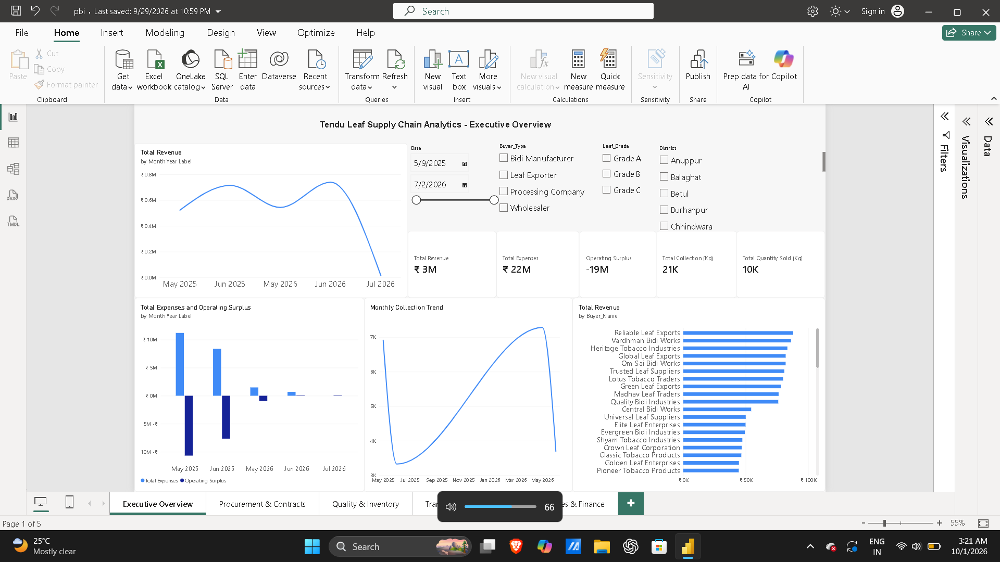

# Power BI Dashboard

This folder contains the Power BI dashboard developed as part of the **Tendu Leaf Supply Chain Analytics** project.

The dashboard presents operational and business analysis across procurement, contracts, quality, inventory, transportation, sales and finance.

## Dashboard Overview

## Dashboard Pages

The Power BI dashboard contains five pages:

### 1. Executive Overview

Provides a summary of key business and operational measures from the project.

### 2. Procurement & Contracts

Presents analysis related to procurement, collection and contracts.

### 3. Quality & Inventory

Presents analysis related to quality inspection, accepted and rejected quantities, and inventory.

### 4. Transportation & Operations

Presents analysis related to transportation and operational activity, including transportation cost and distance.

### 5. Sales & Finance

Presents analysis related to buyers, sales, revenue, selling price, payments and outstanding amounts.

## Key Measures

The dashboard includes measures and KPIs covering areas such as:

- Revenue
- Expenses
- Operating surplus
- Collection quantity
- Quantity sold
- Estimated and actual yield
- Yield achievement
- Accepted and rejected quantity
- Inventory
- Transportation cost
- Transportation distance
- Average distance
- Cost per kg
- Average selling price
- Amount paid
- Outstanding amount

## Project Workflow

The Power BI dashboard represents the reporting and visualisation stage of the overall analytics project.

**Excel → ERD & Database Design → PostgreSQL → SQL Analysis → Python Analysis → Power BI**

The data was prepared and structured before being analysed using SQL and Python. The resulting analysis was then used to develop the interactive Power BI dashboard.

## Tools Used

- Microsoft Excel
- PostgreSQL / pgAdmin
- SQL
- Python
- Power BI

## Project Files

- [Dashboard_Overview.png](Dashboard_Overview.png) — Complete five-page dashboard overview
- [Tendu_Supply_Chain_Analytics.pbix](Tendu_Supply_Chain_Analytics.pbix) — Power BI project file

## Project Context

The project models a tendu leaf procurement and supply-chain business, covering activities from forest procurement and leaf collection through quality inspection, inventory, transportation, sales and financial transactions.

The Power BI dashboard provides an interactive way to explore the resulting operational and financial data.
